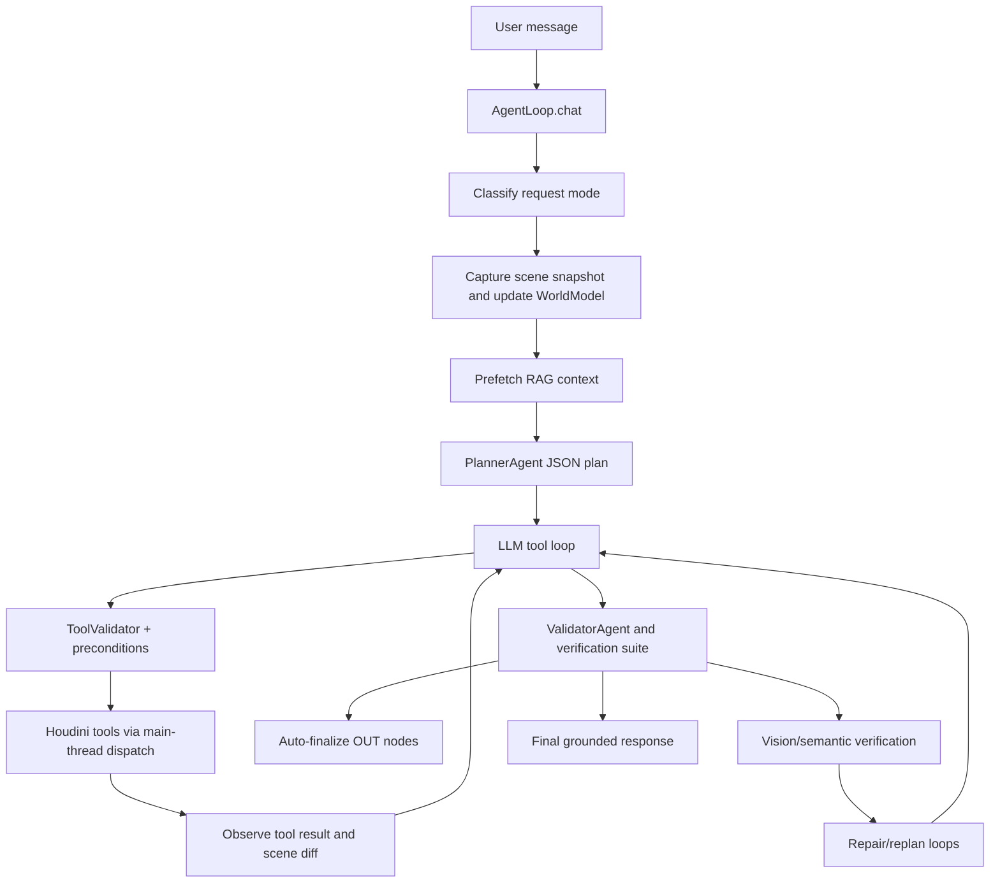
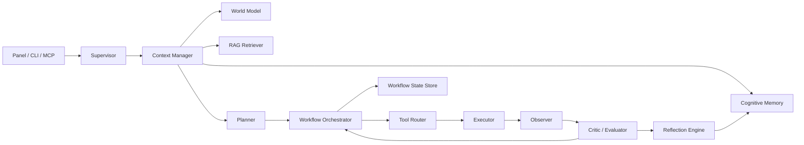

# HoudiniMind Production Agentic AI Redesign

This document is specific to the current HoudiniMind codebase. It describes what exists today, where the architecture is weak, what changed in this pass, and how to evolve the system into a production-grade autonomous, memory-driven agent platform for Houdini 21.

## Current System

HoudiniMind is already beyond a simple chat assistant. The central runtime is `src/houdinimind/agent/loop.py`, which coordinates request classification, RAG injection, planning, tool execution, validation, vision checks, repairs, memory logging, and UI streaming.

Core execution path:



Important existing strengths:

- `AgentLoop` enforces a plan-act-observe loop for build/debug turns through `AgenticController`.
- `PlannerAgent`, `DebuggerAgent`, `ResearcherAgent`, and `ValidatorAgent` already exist in `src/houdinimind/agent/sub_agents.py`.
- Tool execution is schema validated by `src/houdinimind/agent/tool_models.py`.
- Tool calls are hardened with retries, circuit breaker, preconditions, timeouts, optional soft-skip inspection tools, and failure blacklisting.
- `WorldModel` gives the loop a live compressed scene graph and issues list.
- RAG already supports hybrid retrieval and query expansion in `src/houdinimind/rag/`.
- Session learning exists through `MemoryManager`, `RecipeBook`, `ProjectRuleBook`, `MetaRuleLearner`, and `UserLessonLearner`.
- Verification is unusually strong for a Houdini agent: structural checks, geometry inspection, network-view audit, vision goal matching, and semantic scoring.

## Exact Weaknesses

The main architecture risk is not lack of features. It is that too much intelligence is concentrated in `AgentLoop`.

### 1. AgentLoop Is A God Object

`src/houdinimind/agent/loop.py` mixes:

- request routing
- context construction
- planning
- LLM call retries
- tool scheduling
- tool execution
- repair prompts
- verification
- memory writing
- UI progress streaming
- workflow recovery

This makes changes risky because a small behavior tweak can alter full-turn semantics. The existing `components.py` adapters are a good start, but most state and control flow still lives inline.

### 2. Autonomy Is Turn-Local

The agent can plan and repair inside a single chat turn, but long-horizon autonomy is weak because persistent workflow state was missing. Before this pass, a turn had debug logs and session history, but no durable run graph that can be resumed, inspected, scored, or used as a queue item.

### 3. Memory Is Split But Not Retrieval-Centric

Existing memory stores:

- `SessionLog`: raw events
- `RecipeBook`: promoted tool patterns
- `ProjectRuleBook`: explicit user/studio preferences
- `WorldModel`: current scene state
- cross-turn failure JSON in `data/db/failure_memory.json`

Weakness: planning did not have a unified ranked memory context that combines failures, reflections, tool history, lessons, and episodic outcomes. Recipes could be semantically selected, but failures/reflections were mostly prompt-file or JSON blacklist mechanisms.

### 4. Learning Is Mostly Batch/Promotional

The learning cycle can mine accepted sessions and self-corrections, but the live loop needs immediate reflection memory after every turn. Without post-turn reflection, the next turn cannot reliably use "what just failed", "what was verified", or "what repair worked" except through fragile conversation context.

### 5. Tool Orchestration Has Execution Guardrails But No Tool Trust Model

Tools have validation and retries, but the system needs a structured trust score per result:

- schema valid
- preconditions passed
- Houdini status ok/error/skipped
- verification evidence available
- output changed scene
- downstream validation passed

Today this is implicit across `_execute_tool`, `_run_verification_suite`, and final response reconciliation.

### 6. Multi-Agent Architecture Is Present But Not Truly Decoupled

Sub-agents exist, but they are called as specialist methods from the main loop. They do not share a structured state bus, memory contract, or task queue. This is acceptable for a Houdini Python Panel, but production scaling requires clearer protocols.

### 7. Context Engineering Is Good But Incomplete

Strengths:

- dynamic tool schema selection
- history truncation
- task anchor reinjection
- live scene compaction
- RAG category routing

Missing:

- ranked durable memory injection
- memory decay and reinforcement
- explicit context budget allocation per source
- conflict handling between user request, project rules, RAG, and learned memories

### 8. Observability Is Rich But Not Queryable Enough

`DebugLogger` writes JSONL and Markdown. That is excellent for human debugging, but production operations need queryable workflow state, run status, event history, and resumability metadata.

## Implemented In This Pass

### Durable Cognitive Memory

Added `src/houdinimind/memory/cognitive_memory.py`.

Capabilities:

- SQLite-backed memory store.
- Memory kinds: `working`, `episodic`, `semantic`, `procedural`, `tool_usage`, `failure`, `reflection`, `project_rule`.
- Deduplication by stable content hash.
- Lexical retrieval with tag-aware scoring.
- Optional vector scoring through the existing embedding function.
- Ranking by lexical relevance, semantic relevance, importance, confidence, recency, reinforcement, and decay.
- Tool event storage in a structured `tool_events` table.
- Post-turn reflection storage in a structured `reflections` table.
- Memory reinforcement and compaction.
- Prompt rendering with token/character budget.

Integrated in `src/houdinimind/memory/memory_manager.py`:

- `MemoryManager.cognitive_memory`
- tool calls now become retrievable tool/failure memories
- turn outcomes now become reflection memories
- dashboard includes cognitive memory stats

Integrated in `src/houdinimind/agent/loop.py`:

- relevant cognitive memories are injected before the current user message
- final turn outcome is stored after verification and scene diff generation
- fast mode skips the extra memory retrieval for latency

### Persistent Workflow State

Added `src/houdinimind/agent/workflow_state.py`.

Capabilities:

- `workflow_runs` table for durable runs.
- `workflow_events` table for run graph events.
- Stores user goal, request mode, status, plan JSON, checkpoint path, final summary, timestamps.
- Records `run_started`, `plan_updated`, `checkpoint`, `tool_result`, `verification`, and `run_finished`.

Integrated in `src/houdinimind/agent/loop.py`:

- each chat turn starts a workflow run after classification
- generated plans are persisted
- tool results are appended as events
- verification summaries are appended as events
- checkpoint paths are persisted
- completed/partial/failed status is written at turn end

### Tests

Added `tests/test_cognitive_memory.py`.

Coverage:

- failure memories outrank unrelated semantic notes
- duplicate memories reinforce instead of creating duplicates
- `MemoryManager.log_tool_call` feeds cognitive retrieval
- workflow state persists plan/events/checkpoints/status

## Target Cognitive Architecture



Recommended component contracts:

- Supervisor: owns request lifecycle, budget, cancellation, status, and user-visible policy.
- Context Manager: merges system prompt, task anchor, scene state, RAG, cognitive memory, project rules, and tool schemas under explicit budgets.
- Planner: produces a typed plan with steps, dependencies, required tools, verification criteria, rollback policy, and confidence.
- Workflow Orchestrator: stores plan state, marks steps pending/running/succeeded/failed/skipped, schedules retries, and decides when to replan.
- Tool Router: maps intents to tools, validates tool trust level, chooses parallel vs sequential execution, and selects fallbacks.
- Executor: owns HOM main-thread dispatch, retries, circuit breakers, dry-run simulation, confirmation gates, and tool result normalization.
- Observer: refreshes scene snapshot, world model, diffs, viewport/network captures, and output paths.
- Critic/Evaluator: scores outputs against structural, semantic, visual, and task-contract requirements.
- Reflection Engine: converts failures/successes into durable memories and prompt updates.
- Memory Manager: stores and retrieves working, episodic, semantic, procedural, vector, tool, failure, and reflection memories.
- State Manager: persists workflow runs, events, checkpoints, job status, and resumability metadata.

## Memory Redesign

Implemented local memory layers:

- Short-term memory: current `conversation`, `_task_anchor`, turn-local tool history, `_turn_failed_attempts`.
- Working memory: `WorldModel`, live scene snapshot, current plan, current workflow run.
- Episodic memory: `CognitiveMemoryStore` turn outcomes and session events.
- Semantic memory: RAG knowledge base plus cognitive semantic memories.
- Procedural memory: `RecipeBook` and cognitive procedural memories.
- Vector memory: optional embeddings stored per cognitive memory row.
- Structured relational memory: `tool_events`, `reflections`, `workflow_runs`, `workflow_events`.
- Tool usage history: `SessionLog.tool_calls` plus `CognitiveMemoryStore.tool_events`.
- Failure history: existing cross-turn JSON plus cognitive `failure` rows.
- Reflection memory: cognitive `reflection` rows after every turn.

Memory creation policy:

- Tool memory: created on every tool call through `MemoryManager.log_tool_call`.
- Failure memory: created when a tool result has `status == "error"`.
- Reflection memory: created once per turn after final verification and response construction.
- Project rule memory: still handled by `ProjectRuleBook`.
- Recipe memory: still promoted during `run_learning_cycle`.

Retrieval policy:

- Query current user goal.
- Prefer `failure`, `reflection`, `procedural`, `semantic`, `episodic`, then `tool_usage`.
- Score = lexical relevance + optional vector similarity + importance + confidence + recency + reinforcement - decay.
- Inject only bounded rendered memories through `[AGENT MEMORY CONTEXT]`.
- Fast mode skips cognitive retrieval to preserve latency.

Compression, deduplication, decay:

- Deduplication uses stable content hashes.
- Re-seen memories increase reinforcement and access count.
- Successful non-failure tool memories get a 90-day TTL.
- Failures and reflections are durable by default.
- `compact()` prunes expired memories and weak low-importance overflow memories while preserving failures.

## Autonomous Execution Lifecycle

Target lifecycle for build/debug turns:

1. Classify request.
2. Start workflow run.
3. Build context with scene, RAG, project rules, cognitive memory, schemas, and task anchor.
4. Generate typed plan.
5. Persist plan.
6. Execute plan step loop.
7. Validate arguments before each tool call.
8. Dispatch tools through HOM-safe executor.
9. Persist every tool result as workflow event and memory event.
10. Observe scene diff and update world model.
11. Verify structural, visual, semantic, and task-contract requirements.
12. Repair or replan when verification fails.
13. Persist checkpoint, verification report, and final status.
14. Store reflection memory.
15. Finish run as completed, partial, failed, or cancelled.

## Tool Orchestration Improvements

Current tool orchestration is strongest around validation and retries. Next production step is to extract a `ToolRouter` from `AgentLoop` with this API:

```python
class ToolRouter:
    def select_tools(self, request, plan_step, world_model, memory_hits) -> list[ToolCandidate]: ...
    def validate_call(self, tool_name, args, scene_snapshot) -> ToolDecision: ...
    def score_result(self, tool_name, args, result, verification) -> ToolTrustScore: ...
    def fallback(self, failed_call, failure_memory, world_model) -> ToolCandidate | None: ...
```

Required trust fields:

- `schema_valid`
- `preconditions_valid`
- `executed`
- `status`
- `scene_mutated`
- `verified`
- `confidence`
- `retryable`
- `fallback_hint`

Parallel execution policy:

- read-only tools can run concurrently if they do not request viewport capture or HOM-heavy cooks
- write tools stay sequential unless explicitly proven independent
- verification tools run after write groups, not interleaved with writes

## Multi-Agent Recommendation

The code already has specialist sub-agents. Keep them, but do not split into distributed agents inside the Houdini panel yet. HOM access is main-thread bound, and distributed executors would create synchronization risk.

Recommended staged design:

- Phase 1: keep one supervisor process with specialist prompts and shared memory.
- Phase 2: make Planner, Critic, Researcher, and Validator pure services that communicate through `WorkflowStateStore`.
- Phase 3: allow Researcher and Evaluator to run out-of-process because they do not need HOM.
- Phase 4: keep Executor as the only component allowed to mutate Houdini scene state.

Communication protocol:

```json
{
  "run_id": "string",
  "step_id": "string",
  "role": "planner|executor|critic|researcher|validator",
  "intent": "plan|execute|evaluate|reflect",
  "input_refs": ["memory:...", "workflow_event:..."],
  "output": {},
  "confidence": 0.0,
  "requires_user": false
}
```

## Production Deployment Recommendations

Local-first baseline:

- SQLite remains correct for Houdini panel usage.
- Keep RAG files local under runtime-resolved `data_dir`.
- Use `DebugLogger` JSONL plus workflow SQLite for support diagnostics.
- Keep HOM mutation in a single executor.

Team/studio deployment:

- PostgreSQL for workflow state, tool events, reflections, and user feedback.
- pgvector, Qdrant, or LanceDB for vector memory when memory count exceeds local SQLite practicality.
- Redis for short-lived locks, active job state, cancellation tokens, and cache invalidation.
- Celery, Dramatiq, or Arq for background research/evaluation jobs that do not touch HOM.
- OpenTelemetry traces around LLM calls, tool calls, retrieval, verification, and repairs.
- Object storage for viewport/network images and rendered verification frames.
- Per-project memory namespace keyed by `$JOB`, hip file, and studio/user profile.

Reliability requirements:

- every mutation must have a checkpoint or undo record
- every final success must cite verification evidence
- every failure must store an actionable correction memory
- every long-running run must be resumable from workflow state
- every tool result must be normalized into ok/error/skipped/cancelled with duration and trust score

## Refactoring Roadmap

### Immediate

- Move context assembly out of `AgentLoop.chat` into `ContextManager`.
- Move verification report construction into a dedicated `Evaluator`.
- Add typed `ToolResult` and `ToolTrustScore` models.
- Replace cross-turn JSON failure memory with `CognitiveMemoryStore` failure queries.
- Add workflow resume command that loads latest partial workflow run.

### Near Term

- Convert plan steps into persisted step rows with status, dependencies, attempts, and verification criteria.
- Add tool fallback registry by failure type.
- Add memory conflict resolver: user request overrides project rules, project rules override learned recipes, live scene overrides stale memories.
- Add prompt budget allocator with fixed caps: system, task, scene, memory, RAG, tool schemas, history.
- Add evaluation suite for replaying workflow runs from `workflow_events`.

### Production

- Split pure reasoning services from HOM executor.
- Add distributed research and validation workers.
- Add OpenTelemetry exporters.
- Add per-project/user memory namespaces.
- Add retention and privacy controls for images, tool args, and user prompts.
- Add continuous evals for build success, tool-loop efficiency, recovery quality, and false-completion rate.

## Why This Architecture Is Superior

- It turns memories into retrieval evidence instead of static prompt baggage.
- It turns a chat turn into a durable workflow run that can be inspected, resumed, scored, and learned from.
- It preserves the current Houdini-safe execution model instead of introducing unsafe distributed scene mutation.
- It reduces future `AgentLoop` risk by creating concrete stores and contracts that can absorb logic incrementally.
- It gives the planner and repair loop access to failures and reflections that would otherwise be lost after history compaction.
